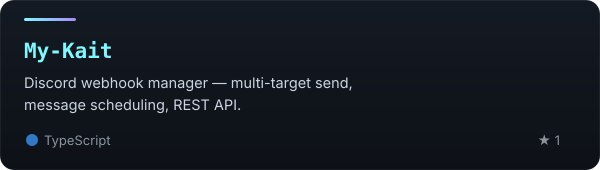
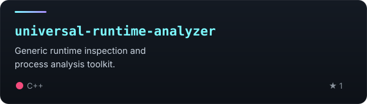
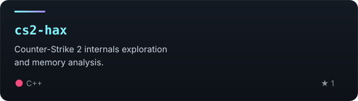
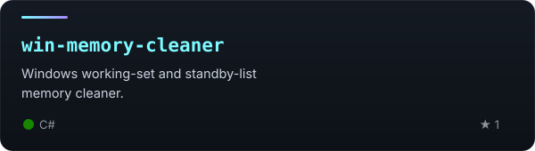
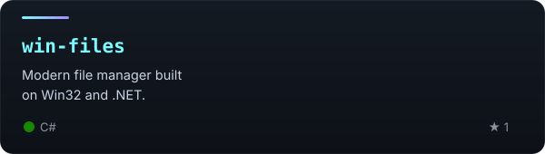
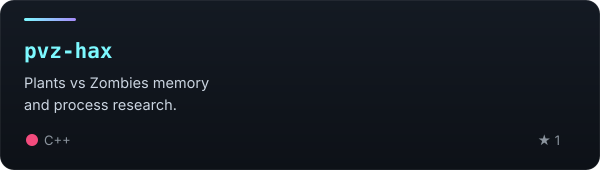
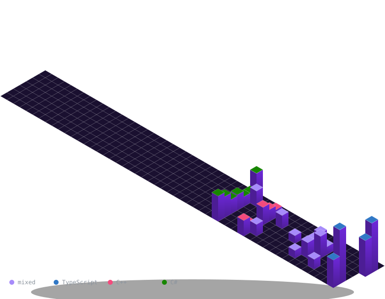

  

### profile

I build systems for a living, and I break them for a living too.

I'm a systems software engineer at **Beyondsoft Singapore**, writing low-level code where there's nothing underneath to catch a mistake. I'm also an offensive security engineer — attack simulation, reverse engineering, exploit analysis. The two halves feed each other: I think like an attacker so the systems I ship don't fall over when a real one shows up.

My work lives close to the metal: **Windows internals**, **binary analysis**, **game security research**. C and C++ are home; C#, Rust, Python and TypeScript cover the rest. On any given day you'll find Ghidra, IDA Pro, x64dbg, WinDbg or Wireshark open on my screen.

### selected work

<table>
  <tr>
    <td width="50%" valign="top">
      
    </td>
    <td width="50%" valign="top">
      
    </td>
  </tr>
  <tr>
    <td width="50%" valign="top">
      
    </td>
    <td width="50%" valign="top">
      
    </td>
  </tr>
  <tr>
    <td width="50%" valign="top">
      
    </td>
    <td width="50%" valign="top">
      
    </td>
  </tr>
</table>

### stack

  

**Languages** — `C` `C++` `C#` `Rust` `Python` `TypeScript`

**Platforms** — `Windows` `Linux` `Win32 API` `.NET` `CMake`

**Reverse engineering** — `Ghidra` `IDA Pro` `x64dbg` `WinDbg` `Wireshark` `Burp Suite`

### activity

<picture>
  <source media="(prefers-color-scheme: dark)" srcset="./profile-3d-contrib/tower-purple.svg" />
  <source media="(prefers-color-scheme: light)" srcset="./profile-3d-contrib/tower-purple.svg" />
  
</picture>

<picture>
  <source media="(prefers-color-scheme: dark)" srcset="https://raw.githubusercontent.com/wisnurafi/wisnurafi/output/snake-dark.svg" />
  <source media="(prefers-color-scheme: light)" srcset="https://raw.githubusercontent.com/wisnurafi/wisnurafi/output/snake.svg" />
  
</picture>

### contact

🌐 [rafiprofile.my.id](https://rafiprofile.my.id) · ✉️ [w6nfii60@gmail.com](mailto:w6nfii60@gmail.com)
