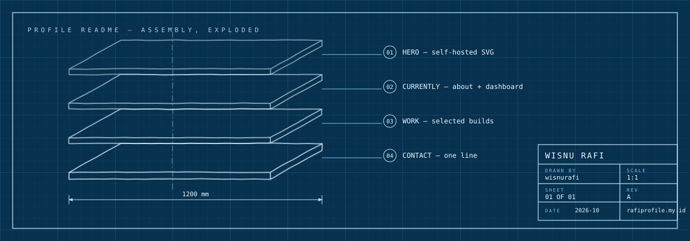
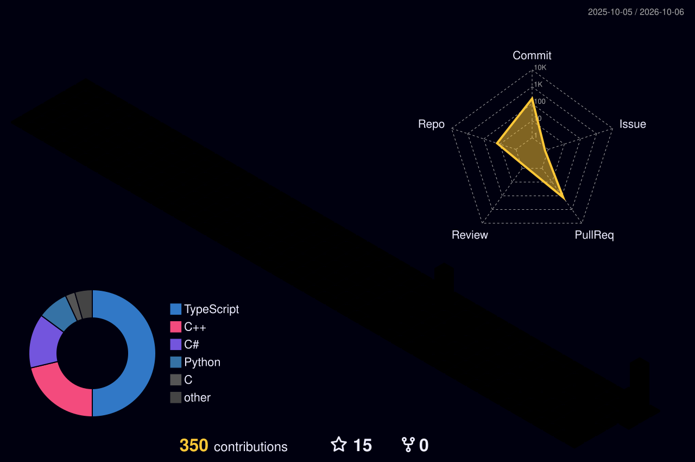

  

### 01 — hero

One self-hosted SVG, no services. Drawn like the systems I work on: dimensioned, leadered, revisioned.

### 02 — currently

Systems software engineer working both sides of the stack — I build reliable low-level systems, then attack them to expose what reliability missed. Currently at **Beyondsoft Singapore** as an offensive security engineer: attack simulation, reverse engineering, exploit analysis.

  

- **Contributions are way up** — My-Kait shipped scheduled messages + REST API this quarter
- **Cadence skews weekdays** — 90% of activity lands Mon–Fri
- **Streak: 2 days and counting** — the push continues

### 03 — work

- **[My-Kait](https://github.com/wisnurafi/My-Kait)** — Discord webhook manager: multi-target send, scheduling, REST API
- **[universal-runtime-analyzer](https://github.com/wisnurafi/universal-runtime-analyzer)** — generic runtime inspection & process analysis
- **[cs2-hax](https://github.com/wisnurafi/cs2-hax)** — CS2 internals exploration & memory analysis
- **[win-memory-cleaner](https://github.com/wisnurafi/win-memory-cleaner)** — working-set & standby-list memory cleaner
- **[win-files](https://github.com/wisnurafi/win-files)** — modern file manager on Win32 / .NET
- **[pvz-hax](https://github.com/wisnurafi/pvz-hax)** — Plants vs Zombies memory & process research

<picture>
  <source media="(prefers-color-scheme: dark)" srcset="https://raw.githubusercontent.com/wisnurafi/wisnurafi/output/snake-dark.svg" />
  <source media="(prefers-color-scheme: light)" srcset="https://raw.githubusercontent.com/wisnurafi/wisnurafi/output/snake.svg" />
  
</picture>

The snake above is built fresh every day — it's eating real commits, not props.

<picture>
  <source media="(prefers-color-scheme: dark)" srcset="./profile-3d-contrib/profile-night-rainbow.svg" />
  <source media="(prefers-color-scheme: light)" srcset="./profile-3d-contrib/profile-season.svg" />
  
</picture>

- **Tall** weeks = shipping My-Kait milestones
- **Flat** stretches = deep-research weeks
- **Spiky** weekends = side projects

### 04 — contact

[rafiprofile.my.id](https://rafiprofile.my.id) · [w6nfii60@gmail.com](mailto:w6nfii60@gmail.com)
